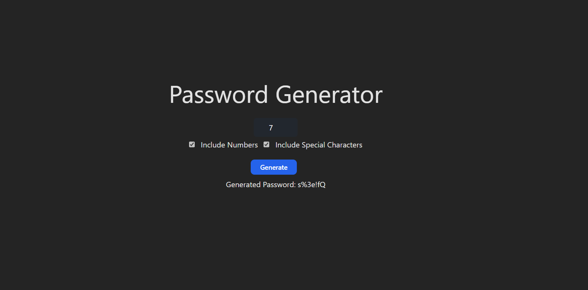

# Password Generator

A password generator project built with React. This project allows users to generate secure passwords with customizable options such as length, inclusion of numbers, and inclusion of special characters.

## Table of Contents

- [Demo](#demo)
- [Features](#features)
- [Installation](#installation)
-

## Demo



## Features

- Generate passwords with customizable length.
- Choose whether to include numbers in the generated passwords.
- Choose whether to include special characters in the generated passwords.

## Installation

1. Clone the repository:

   ```bash
   git clone https://github.com/insshubh/passWordGEnerator.git
